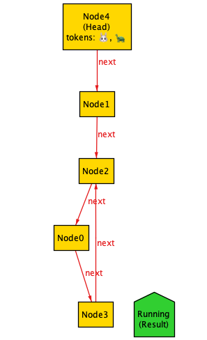
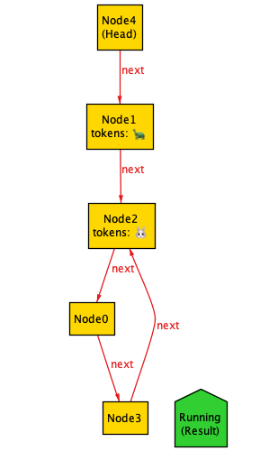
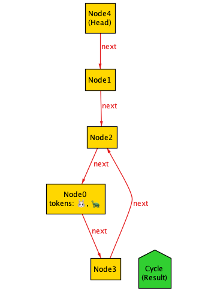

# Tortoise and Hare algorithm in Alloy

An implementation of Robert Floyd's cycle detection algorithm in Alloy 6.

See also: [The Tortoise and the Hare in TLA+](https://github.com/lorin/tla-tortoise-hare)

## Example trace

Here's an example of a trace that contains a cycle.

### State 0

### State 1

### State 2

### State 3

